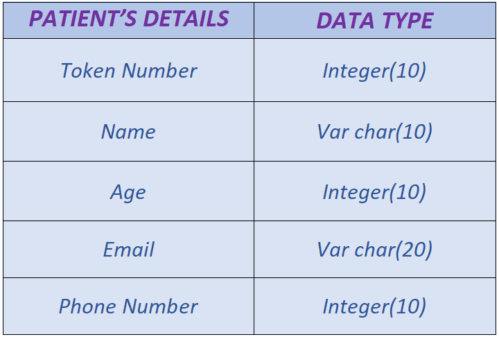
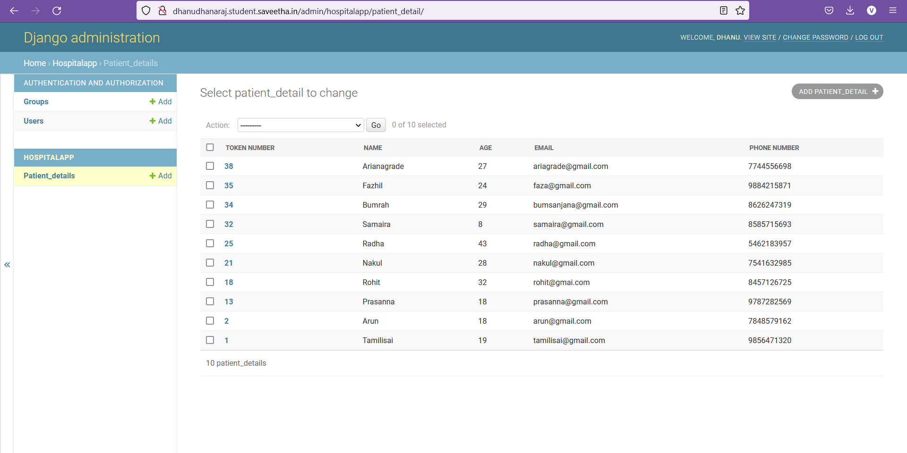

# Django ORM Web Application

## AIM:
To develop a Django application to store and retrieve data from a database using Object Relational Mapping(ORM).

## Entity Relationship Diagram:


## DESIGN STEPS:

### STEP 1:
Create a new Django project using "django-admin startproject",get into the project's terminal and use "python3 manage.py startapp hospitalproject" command.

### STEP 2:
Define a model for the Hospitalapp in the models.py and allow host access and add the app name under the installed apps in settings.py

### STEP 3:
Register the models with the Django admin site. In admin.py under app folder, register the models with Django admin site.


## PROGRAM
```

#IN models.py:-

from django.db import models
from django.contrib import admin
#Create your model here.

class Patient_detail(models.Model):
    Token_number = models.IntegerField(primary_key=True)
    Name = models.CharField(max_length=100)
    age = models.IntegerField()
    email = models.EmailField()
    phone_number = models.IntegerField()

class Patient_detailAdmin(admin.ModelAdmin):
    list_display = ('Token_number','Name','age','email','phone_number')

#IN admin.py:-

from django.contrib import admin
from .models import Patient_detail,Patient_detailAdmin
# Register your models here.
admin.site.register(Patient_detail,Patient_detailAdmin)

```
## OUTPUT:


## RESULT:
Thus a Django application to store and retrieve data from a database using Object Relational Mapping(ORM) is developed.


